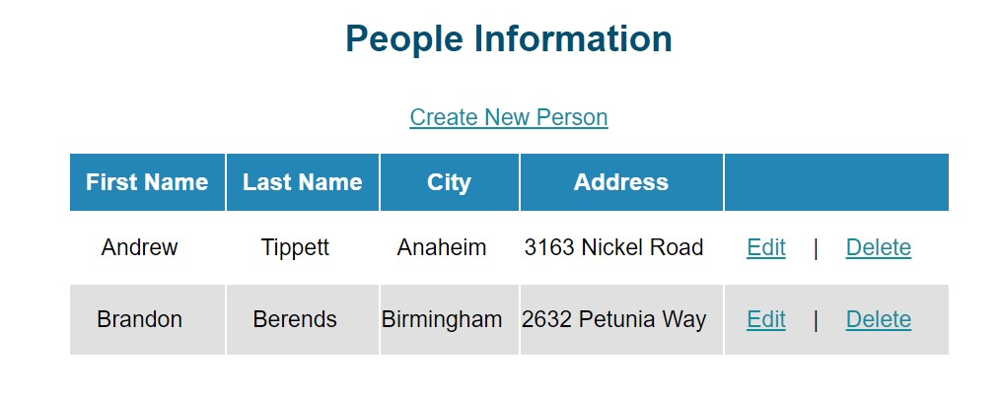

# Tareas del MOC

## MOD 7 - Using Entity Framework Core in ASP.NET Core

### L3:Using Entity Framework Core to Connect to Microsoft SQL Server

### Demonstration: How to Apply the Repository Pattern

